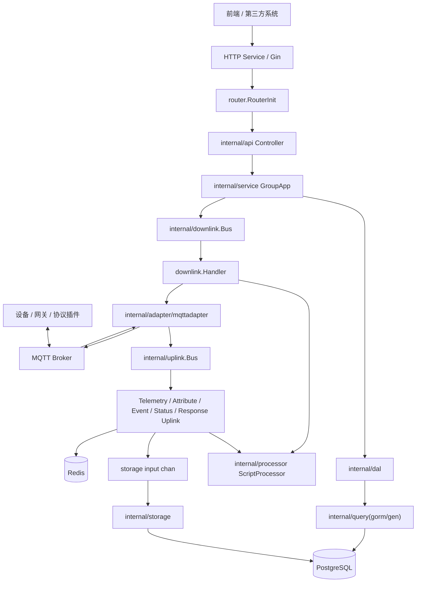
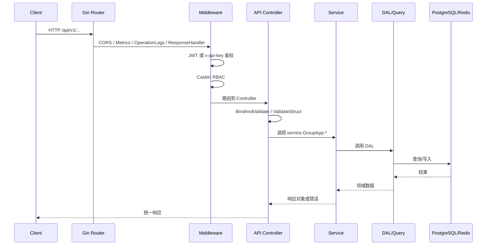
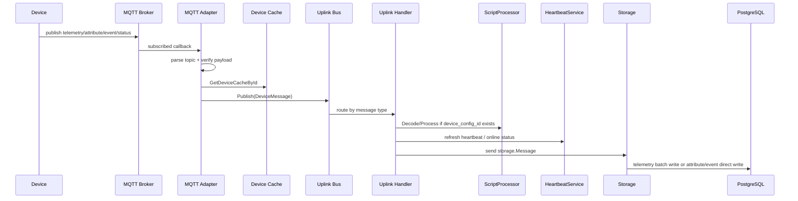
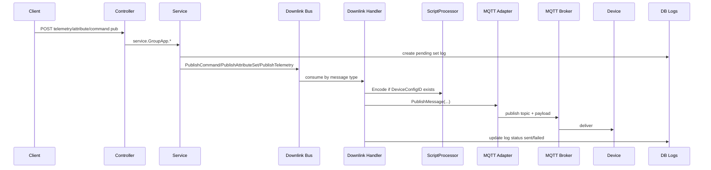

# ThingsPanel 后端反向工程设计文档

> 本文基于当前代码实现整理，重点描述软件架构、接口定义、模块交互流程和主要数据模型。代码入口为 `main.go`，HTTP 路由集中在 `router/`，核心业务在 `internal/`。

## 1. 项目定位

ThingsPanel Backend Community 是一个面向物联网设备接入、管理、数据采集、自动化联动和告警通知的 Go 后端。系统同时提供：

- 面向前端/第三方系统的 HTTP REST API、WebSocket、SSE、Prometheus Metrics。
- 面向设备/协议插件的 MQTT 上行、下行通信。
- 面向设备遥测、属性、事件的异步处理和存储流水线。
- 用户、租户、权限、设备、物模型、插件、场景、告警、OTA、消息推送等管理能力。

主要技术栈：

| 类别 | 实现 |
| --- | --- |
| 语言/框架 | Go 1.23、Gin |
| ORM/代码生成 | GORM、gorm/gen，生成文件位于 `internal/model/*.gen.go`、`internal/query/*.gen.go` |
| 数据库 | PostgreSQL，配置中支持 TimescaleDB 类型外部服务 |
| 缓存 | Redis |
| 设备通信 | Eclipse Paho MQTT |
| 权限 | JWT、API Key、Casbin RBAC |
| 定时/监控 | robfig/cron、Prometheus、gopsutil |
| 脚本处理 | Lua 脚本处理器，位于 `internal/processor` |
| 文档 | Swagger 生成文件位于 `docs/swagger.yaml`、`docs/swagger.json` |

## 2. 总体架构

系统采用“应用启动编排 + HTTP 分层业务 + 设备消息流水线”的结构。`main.go` 通过 Option 模式创建 `Application`，按依赖顺序注册并启动服务：

1. 配置、RSA、日志、数据库、Redis。
2. Storage 存储服务。
3. Uplink 数据流服务。
4. 心跳监控、诊断服务。
5. MQTT Adapter 服务。
6. Downlink 下行服务。
7. gRPC、HTTP、Cron、匿名遥测服务。



## 3. 代码目录职责

| 目录 | 职责 |
| --- | --- |
| `main.go` | 程序入口，组装 Application 并启动所有服务 |
| `internal/app` | 应用生命周期、Option 初始化、HTTP/MQTT/Uplink/Downlink/Storage 等服务包装器 |
| `router` | Gin 路由注册，包括公共接口、鉴权接口、模块路由、SSE |
| `internal/api` | Controller 层，请求绑定、参数校验、调用 service、写入统一响应 |
| `internal/service` | 业务服务层，承载用户、设备、物模型、告警、场景、插件等核心业务 |
| `internal/dal` | 手写数据访问层，封装 GORM/gen 查询和复杂 SQL |
| `internal/model` | 数据模型、HTTP DTO、VO；`.gen.go` 为生成代码 |
| `internal/query` | gorm/gen 生成的类型安全查询对象 |
| `internal/adapter/mqttadapter` | 新 MQTT 适配器，负责订阅、解析 Topic、转换消息、发布下行 |
| `internal/uplink` | 上行消息总线和各类上行处理器 |
| `internal/downlink` | 下行消息总线、Handler、下行消息抽象 |
| `internal/storage` | 遥测批量写入、属性/事件直接写入、存储指标 |
| `internal/processor` | 数据处理脚本执行，支持上行解码和下行编码 |
| `internal/middleware` | CORS、JWT/APIKey、Casbin、操作日志、Metrics、统一响应 |
| `initialize` | 配置依赖初始化、Redis/PG/Casbin/日志/缓存/定时任务 |
| `mqtt` | 旧 MQTT 配置、旧 subscribe/publish 兼容代码；当前主链路由 `mqttadapter` 接管 |
| `pkg` | 公共工具、常量、错误码、全局变量、系统指标 |
| `configs` | 系统配置、Casbin 配置、RSA key、响应消息 |
| `sql` | 数据库初始化/迁移 SQL |
| `docs` | Swagger、开发规范、历史设计和需求文档 |

## 4. 启动与服务生命周期

`internal/app.Application` 持有全局依赖：

- `Config *viper.Viper`
- `Logger *logrus.Logger`
- `DB *gorm.DB`
- `RedisClient *redis.Client`
- `ServiceManager *ServiceManager`
- `storageService/storageInputChan`
- `uplinkService/mqttService/downlinkService`

所有运行组件实现统一接口：

```go
type Service interface {
    Name() string
    Start() error
    Stop() error
}
```

`ServiceManager.StartAll()` 按注册顺序启动服务，`StopAll()` 按反向顺序停止服务。当前注册顺序很重要：

| 顺序 | 服务 | 关键依赖 |
| --- | --- | --- |
| 1 | Storage | DB |
| 2 | Uplink | Storage input channel、Redis |
| 3 | Heartbeat/Diagnostics | Redis、Uplink Bus |
| 4 | MQTT | Uplink Bus |
| 5 | Downlink | MQTT Adapter、Processor |
| 6 | gRPC/HTTP/Cron/Telemetry | 配置、DB、Redis、业务服务 |

配置加载支持 `-config` 参数；未指定时默认读取生产配置 `configs/conf.yml`。环境变量前缀为 `GOTP`，例如 `GOTP_DB_PSQL_HOST`。

## 5. HTTP 架构与接口定义

### 5.1 HTTP 请求链路



### 5.2 认证与权限

公共接口位于 `/api/v1` 下，在 `JWTAuth()` 之前注册，例如登录、设备动态认证、插件心跳、WebSocket 部分入口等。

鉴权接口经过：

1. `JWTAuth()`：优先读取 `x-token`，验证 Redis 中 token 状态并解析 JWT；无 token 时尝试 `x-api-key`。
2. `CasbinRBAC()`：若接口资源在 Casbin 表中配置，则按“用户-角色-功能-资源-动作”校验。
3. `OperationLogs()`：记录操作日志。
4. `response.Handler`：统一错误/成功响应消息。

### 5.3 路由概览

基础路径：`/api/v1`。

| 模块 | 路由前缀 | 主要能力 |
| --- | --- | --- |
| 系统 | `/health`、`/api/v1/systime`、`/api/v1/sys_version`、`/metrics`、`/swagger/*any` | 健康检查、系统时间、版本、Prometheus、Swagger |
| 用户/租户 | `/api/v1/login`、`/api/v1/user`、`/api/v1/tenant/*` | 登录、注册、重置密码、用户 CRUD、租户初始化 |
| 权限 | `/api/v1/role`、`/api/v1/casbin`、`/api/v1/sys_function`、`/api/v1/sys_ui_elements` | 角色、资源权限、功能开关、UI 元素 |
| 字典 | `/api/v1/dict` | 字典列、语言、枚举、协议/服务字典 |
| 设备 | `/api/v1/device` | 设备 CRUD、激活、在线状态、网关/子设备、连接信息、调试日志、状态历史 |
| 设备模板/物模型 | `/api/v1/device/template`、`/api/v1/device/model` | 模板、市场发布/安装、遥测/属性/事件/命令模型 |
| 设备配置 | `/api/v1/device/config` | 设备配置、凭证类型、连接表单、批量配置 |
| 主题映射 | `/api/v1/device/topic-mappings` | 自定义设备 Topic 转换规则 |
| 遥测 | `/api/v1/telemetry/datas` | 当前值、历史值、统计、模拟、下发、WebSocket |
| 属性 | `/api/v1/attribute/datas` | 属性列表、属性设置/获取、设置日志 |
| 事件 | `/api/v1/event/datas` | 事件分页查询 |
| 命令 | `/api/v1/command/datas` | 命令下发、下发日志、命令列表 |
| 告警 | `/api/v1/alarm` | 告警配置、告警信息、告警历史、设备告警状态 |
| 场景/自动化 | `/api/v1/scene`、`/api/v1/scene/automations` | 场景 CRUD/激活、联动规则、联动日志 |
| OTA | `/api/v1/ota/*` | 升级包、升级任务、任务明细、文件下载 |
| 插件 | `/api/v1/protocol_plugin`、`/api/v1/service/plugin`、`/api/v1/service/access` | 协议插件、服务插件、服务接入、插件心跳 |
| 通知 | `/api/v1/notification/group`、`/api/v1/notification/history`、`/api/v1/notification/services/config` | 通知组、通知历史、邮件测试 |
| 消息推送 | `/api/v1/message/push` | 设备/移动端消息推送配置、登录/登出 |
| 看板 | `/api/v1/board`、`/api/v1/dashboard/menu` | 首页看板、趋势、租户/设备/用户统计、仪表盘菜单 |
| 数据脚本 | `/api/v1/data/script` | 脚本 CRUD、脚本测试、启停 |
| 数据策略 | `/api/v1/data/policy` | 数据清理策略 |
| OpenAPI Key | `/api/v1/open/api/key` | API Key 创建、列表、更新、删除 |
| 系统监控 | `/api/v1/system/metrics/*` | 当前和历史系统指标 |
| 文件 | `/files/*filepath`、`/api/v1/upload/up` | 静态文件访问、上传 |

详细请求/响应字段以 `docs/swagger.yaml`、`internal/model/*.http.go` 为准。

## 6. 设备上行数据流

当前主链路已从旧的 `mqtt/subscribe` 迁移到 `internal/adapter/mqttadapter`。

### 6.1 MQTT Topic

| 类型 | Topic |
| --- | --- |
| 直连遥测上报 | `devices/telemetry` |
| 直连属性上报 | `devices/attributes/{message_id}` |
| 直连事件上报 | `devices/event/{message_id}` |
| 设备状态上报 | `devices/status/{device_id}` |
| 网关遥测上报 | `gateway/telemetry` |
| 网关属性上报 | `gateway/attributes/{message_id}` |
| 网关事件上报 | `gateway/event/{message_id}` |
| 命令响应 | `devices/command/response/{message_id}`、`gateway/command/response/{message_id}` |
| 属性设置响应 | `devices/attributes/set/response/{message_id}`、`gateway/attributes/set/response/{message_id}` |

设备上报 Payload 的公共包装格式：

```json
{
  "device_id": "设备ID",
  "values": "业务数据的 JSON bytes"
}
```

### 6.2 上行处理流程



`internal/uplink.Bus` 按类型分发到不同 channel：

- `telemetryChan`
- `attributeChan`
- `eventChan`
- `statusChan`
- `responseChan`

支持 `gateway_telemetry`、`gateway_attribute`、`gateway_event` 与直连设备类型复用同一处理器。

### 6.3 存储策略

`internal/storage` 将上行结果统一为 `storage.Message`：

```go
type Message struct {
    DeviceID  string
    TenantID  string
    DataType  DataType // telemetry / attribute / event
    Timestamp int64
    Data      interface{}
}
```

写入规则：

| 数据类型 | 写入方式 | 表 |
| --- | --- | --- |
| 遥测 | 批量写入，按 `telemetry_batch_size` 和 `telemetry_flush_interval` flush | `telemetry_datas`、`telemetry_current_datas` |
| 属性 | 直接写入 | `attribute_datas` |
| 事件 | 直接写入 | `event_datas` |

## 7. 设备下行数据流

下行能力由业务服务发起，`WithDownlinkService()` 会把 `downlink.Bus` 注入到 `CommandData`、`AttributeData`、`TelemetryData` 服务。

### 7.1 下行 Topic

| 类型 | Topic |
| --- | --- |
| 命令下发 | `devices/command/{device_number}/{message_id}` |
| 属性设置 | `devices/attributes/set/{device_number}/{message_id}` |
| 属性获取 | `devices/attributes/get/{device_number}` |
| 遥测控制 | `devices/telemetry/control/{device_number}` |
| 网关命令下发 | `gateway/command/{gateway_number}/{message_id}` |
| 网关属性设置 | `gateway/attributes/set/{gateway_number}/{message_id}` |
| 网关属性获取 | `gateway/attributes/get/{gateway_number}` |
| 网关遥测控制 | `gateway/telemetry/control/{gateway_number}` |

### 7.2 下行处理流程



下行 Handler 的核心行为：

- 校验 `DeviceNumber`、`Data` 等必要字段。
- 如果有 `DeviceConfigID`，执行脚本编码；否则直接使用原始数据。
- 通过 `MessagePublisher` 抽象调用 MQTT Adapter 发布。
- 根据消息类型更新命令日志或属性设置日志，状态为 pending/sent/failed。
- 记录诊断数据，包括编码失败、发布失败等阶段。

## 8. 业务模块设计

### 8.1 用户、租户与权限

核心文件：

- `internal/api/sys_user.go`
- `internal/service/sys_user.go`
- `internal/service/jwt.go`
- `internal/service/casbin.go`
- `internal/middleware/jwt_auth.go`
- `internal/middleware/casbin_middle.go`

职责：

- 用户登录、退出、刷新 token、重置密码、验证码。
- 首次安装初始化超管、租户注册、市场注册。
- 用户 CRUD、用户资料、地址、用户选择器。
- JWT token 存 Redis 做会话状态控制。
- API Key 可作为接口访问凭证，鉴权后构造租户管理员 claims。
- Casbin 负责 URL 资源级权限校验。

### 8.2 设备与物模型

核心文件：

- `internal/api/device.go`
- `internal/service/device.go`
- `internal/service/device_template*.go`
- `internal/service/device_model.go`
- `internal/dal/devices.go`
- `internal/model/devices.gen.go`

职责：

- 设备 CRUD、激活、凭证更新、启停、在线状态、状态历史。
- 网关和子设备注册、子设备管理。
- 设备分组和分组关系。
- 设备模板/物模型管理，包含遥测、属性、事件、命令、自定义命令/控制。
- 设备配置绑定和连接参数生成。

### 8.3 数据采集与查询

核心文件：

- `internal/api/telemetry_data.go`
- `internal/api/attribute_data.go`
- `internal/api/event_data.go`
- `internal/service/telemetry_data.go`
- `internal/service/attribute_data.go`
- `internal/service/event_data.go`
- `internal/storage/*`

职责：

- 查询遥测当前值、历史值、统计值、批量统计、当前 key。
- 查询属性、事件数据。
- WebSocket 推送当前遥测、遥测 key、设备在线状态。
- 支持遥测/属性/命令模拟或下发。

### 8.4 场景、自动化与告警

核心文件：

- `internal/service/scene.go`
- `internal/service/scene_automations.go`
- `internal/service/automate_*.go`
- `internal/service/alarm.go`
- `initialize/automate_cache.go`
- `initialize/alarm_cache.go`

职责：

- 场景：一组动作集合，可手动激活。
- 场景联动：条件触发动作，支持设备、场景、告警、服务等动作类型。
- 告警：告警配置、当前告警、历史、恢复、通知触达。
- 自动化缓存和限流在初始化阶段装载，用于运行时快速判断。

### 8.5 插件与服务接入

核心文件：

- `internal/service/protocol_plugin.go`
- `internal/service/service_plugin.go`
- `internal/service/service_access.go`
- `internal/service/protocol_plugin/notify_plugin.go`
- `internal/adapter/mqttadapter`

职责：

- 协议插件：保存协议类型、接入地址、HTTP 地址、订阅前缀、表单配置。
- 服务插件：注册服务标识、类型、配置、心跳。
- 服务接入：为租户配置接入点、凭证、服务配置，并支持批量创建设备。
- 插件通过 HTTP 接口和 MQTT Topic 与平台交互。

## 9. 主要数据模型

### 9.1 租户与用户

| 表/模型 | 关键字段 | 说明 |
| --- | --- | --- |
| `users` / `User` | `id`、`phone_number`、`email`、`password`、`tenant_id`、`authority`、`status`、`timezone`、`default_language` | 用户账号、权限类型、租户归属、登录安全信息 |
| `roles` / `Role` | `id`、`name`、`tenant_id` 等 | 角色 |
| `casbin_rule` | `ptype`、`v0`、`v1`... | Casbin 权限策略 |
| `open_api_keys` | `api_key`、`tenant_id`、`status`、`created_id` | 第三方访问密钥 |

### 9.2 设备域

| 表/模型 | 关键字段 | 说明 |
| --- | --- | --- |
| `devices` / `Device` | `id`、`name`、`voucher`、`tenant_id`、`device_number`、`device_config_id`、`parent_id`、`protocol`、`is_online`、`access_way` | 设备实例，支持直连、网关、子设备 |
| `device_configs` / `DeviceConfig` | `id`、`name`、`device_template_id`、`device_type`、`protocol_type`、`voucher_type`、`protocol_config`、`auto_register` | 设备接入配置 |
| `device_templates` / `DeviceTemplate` | `id`、`name`、`version`、`tenant_id`、`label`、`brand`、`model_number`、`web_chart_config` | 设备模板/产品模型 |
| `groups` | `id`、`name`、`tenant_id` 等 | 设备分组 |
| `r_group_device` | `group_id`、`device_id` | 设备和分组关系 |
| `device_status_history` | `device_id`、`status`、`ts` 等 | 在线/离线历史 |
| `device_topic_mappings` | `device_id/config_id`、`topic`、`mapping` 等 | 主题转换规则 |

### 9.3 物模型

| 表/模型 | 关键字段 | 说明 |
| --- | --- | --- |
| `device_model_telemetry` | `device_template_id`、`data_name`、`data_identifier`、`data_type`、`unit`、`read_write_flag` | 遥测定义 |
| `device_model_attributes` | `device_template_id`、`data_identifier`、`data_type`、`read_write_flag` | 属性定义 |
| `device_model_events` | `device_template_id`、`data_identifier`、`params` | 事件定义 |
| `device_model_commands` | `device_template_id`、`data_identifier`、`params` | 命令定义 |
| `device_model_custom_commands` | 自定义命令字段 | 自定义命令 |
| `device_model_custom_control` | 自定义控制字段 | 自定义控制 |

### 9.4 设备数据

| 表/模型 | 关键字段 | 说明 |
| --- | --- | --- |
| `telemetry_datas` | `device_id`、`key`、`ts`、`bool_v`、`number_v`、`string_v`、`tenant_id` | 遥测历史值，按值类型拆列 |
| `telemetry_current_datas` | `device_id`、`key`、`ts`、`bool_v`、`number_v`、`string_v`、`tenant_id` | 遥测最新值 |
| `attribute_datas` | `id`、`device_id`、`key`、`ts`、`bool_v`、`number_v`、`string_v`、`tenant_id` | 属性上报值 |
| `event_datas` | `id`、`device_id`、`identify`、`ts`、`data`、`tenant_id` | 事件数据 |
| `telemetry_set_logs` | `message_id`、`device_id`、`status` 等 | 遥测控制日志 |
| `attribute_set_logs` | `message_id`、`device_id`、`status`、`error_message` | 属性设置日志 |
| `command_set_logs` | `message_id`、`device_id`、`status`、`error_message` | 命令下发日志 |

### 9.5 自动化、告警与通知

| 表/模型 | 关键字段 | 说明 |
| --- | --- | --- |
| `scene_info` | `id`、`name`、`tenant_id`、`enabled` | 场景 |
| `scene_action_info` | `scene_id`、`action_target`、`action_type`、`action_param_type`、`action_param`、`action_value` | 场景动作 |
| `scene_automations` | `id`、`name`、`enabled`、`tenant_id`、`creator` | 联动规则 |
| `action_info` | `scene_automation_id`、`action_type`、`action_target`、`action_param`、`action_value` | 联动动作 |
| `device_trigger_condition` | 条件字段 | 联动触发条件 |
| `alarm_config` | `id`、`name`、`alarm_level`、`notification_group_id`、`enabled`、`tenant_id` | 告警配置 |
| `alarm_info` | `alarm_config_id`、`alarm_time`、`processing_result`、`processor` | 当前告警 |
| `alarm_history` | `alarm_config_id`、`scene_automation_id`、`alarm_status`、`alarm_device_list` | 告警历史 |
| `notification_groups` | 通知组字段 | 通知对象分组 |
| `notification_services_config` | 通知服务类型、配置 | 邮件等通知通道配置 |
| `notification_histories` | 通知历史字段 | 通知发送记录 |

### 9.6 插件、OTA 与看板

| 表/模型 | 关键字段 | 说明 |
| --- | --- | --- |
| `protocol_plugins` | `name`、`device_type`、`protocol_type`、`access_address`、`http_address`、`sub_topic_prefix` | 协议插件 |
| `service_plugins` | `service_identifier`、`service_type`、`last_active_time`、`service_config` | 服务插件 |
| `service_access` | `service_plugin_id`、`voucher`、`service_access_config`、`tenant_id` | 租户服务接入点 |
| `ota_upgrade_packages` | 升级包字段 | OTA 包 |
| `ota_upgrade_tasks` / `ota_upgrade_task_details` | 任务和设备明细字段 | OTA 任务 |
| `boards`、`vis_dashboard`、`vis_plugin` | 看板和可视化插件字段 | 首页、可视化和仪表盘 |

## 10. 脚本处理器

`internal/processor` 是设备协议转换的重要边界。它提供统一接口：

- 上行：将设备原始 payload 按设备配置/脚本解码为平台标准遥测、属性、事件。
- 下行：将平台标准控制数据按设备配置/脚本编码为设备可识别 payload。

`ScriptProcessor` 被 Uplink 和 Downlink 同时使用。下行 Handler 中的策略是：

- `DeviceConfigID` 存在：执行 Encode。
- `DeviceConfigID` 为空：直接发送原始 `Data`。

这说明系统允许部分设备走协议配置脚本，也允许透传式设备/插件接入。

## 11. 缓存与运行时状态

Redis 和内存缓存主要用于：

- JWT token 会话状态和续期。
- API Key 缓存。
- 设备状态/心跳缓存，`global.STATUS_REDIS` 和心跳监控使用。
- 设备配置、告警、自动化缓存，初始化文件位于 `initialize/*cache*.go`。
- Redis key 过期事件用于心跳离线检测。

运行时诊断位于 `internal/diagnostics`，可记录设备上行/下行总数、失败阶段、错误信息，并通过设备诊断接口查询。

## 12. 设计约束与扩展点

1. 不要直接修改 `internal/model/*.gen.go` 和 `internal/query/*.gen.go`，这些文件由 gorm/gen 生成。
2. 新增接口请求结构优先放在 `internal/model/*.http.go`，并使用 validator 标签；项目约定 GET DTO 必须带 `form` 标签。
3. Controller 层使用 `BindAndValidate` / `ValidateStruct` 做请求绑定与校验。
4. 新业务模块建议沿用 `router/apps -> internal/api -> internal/service -> internal/dal -> internal/model/query` 分层。
5. 设备上行新协议优先扩展 `internal/adapter/mqttadapter`、Topic 解析和 `processor`，避免回到旧 `mqtt/subscribe` 链路。
6. 下行新动作优先扩展 `downlink.MessageType`、`downlink.Bus`、`downlink.Handler` 和业务服务注入点。
7. 涉及用户可见接口的权限需同步维护 Casbin 资源配置。
8. 存储链路中遥测是批量写入，属性/事件是直接写入；高频数据扩展时要关注 channel buffer、batch size、flush interval。

## 13. 典型开发路径

新增一个普通管理模块：

1. 在数据库 SQL 中新增表。
2. 使用 gorm/gen 生成 `model` 和 `query`。
3. 新增 `internal/model/xxx.http.go` 定义请求/响应。
4. 新增 `internal/dal/xxx.go` 封装数据访问。
5. 新增 `internal/service/xxx.go` 实现业务。
6. 在 `internal/service/enter.go` 的 `ServiceGroup` 嵌入服务。
7. 新增 `internal/api/xxx.go`。
8. 在 `internal/api/enter.go` 的 `Controller` 嵌入 API。
9. 新增 `router/apps/xxx.go` 并在 `router/router_init.go` 注册。
10. 配置 Casbin 资源和前端菜单/按钮权限。

新增一个设备上行数据类型：

1. 在 `mqttadapter/topics.go` 定义 Topic。
2. 在 Adapter 中订阅并解析消息，转换为统一消息。
3. 在 `uplink.Bus` 中增加 channel 和路由。
4. 新增对应 Uplink 处理器，接入 `UplinkManager`。
5. 如需落库，扩展 `storage.DataType`、writer 和数据库表。

## 14. 当前实现观察

- 项目正在从旧 MQTT subscribe/publish 流程迁移到新的 Adapter + Uplink/Downlink 架构，`mqtt/subscribe` 仍存在但当前启动路径明确绕过旧流程。
- HTTP 业务层仍使用全局 `service.GroupApp` 聚合服务，便于调用但隐藏依赖关系；新增复杂模块时建议显式记录跨服务依赖。
- `ServiceManager` 使用 WaitGroup 等待服务停止，但 `StartAll()` 只 Add，不启动长期 goroutine 归属管理；当前可运行，但后续如新增阻塞式服务需谨慎处理生命周期。
- 数据模型由生成代码和手写 HTTP DTO 混合组成，维护时要区分“数据库模型”和“接口模型”。
- 路由数量较多，Swagger 是接口细节的权威入口；本文只维护架构级接口矩阵。
